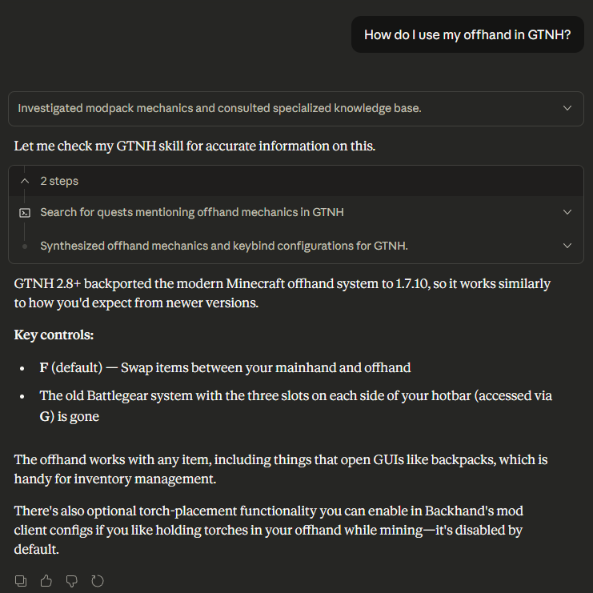

# GTNH Claude Skill

A Claude skill that provides queryable access to GregTech: New Horizons data. This skill allows claude to provide accurate information
about GTNH based on the installation data of the game itself, most notably the quest data. 

The skill is powered by a JVM CLI application that can index and query data from a GTNH installation.



## Features

- Index quest data from any GTNH installation
- Query quest lines and quests via SQL
- Full-text search using SQLite FTS5
- Track quest prerequisites and dependencies

## Quick Start

```bash
# Build the skill with pre-indexed quest data
./gradlew buildSkill -PgtnhPath="/path/to/GTNH/installation"

# Output: build/release/gtnh-skill/
```

## Example Queries

```sql
-- Search quests by keyword
SELECT name FROM quests_fts WHERE quests_fts MATCH 'quantum'

-- Find quests in a specific tier
SELECT q.name FROM quests q
JOIN quest_line_entries e ON q.id = e.quest_id
JOIN quest_lines l ON e.quest_line_id = l.id
WHERE l.name LIKE '%Tier 5%'

-- Get quest prerequisites
SELECT p.name FROM quest_prerequisites qp
JOIN quests q ON qp.quest_id = q.id
JOIN quests p ON qp.prerequisite_quest_id = p.id
WHERE q.name LIKE '%Quantum%'
```

## Database Schema

| Table | Description |
|-------|-------------|
| `quest_lines` | Quest categories (46 total) |
| `quests` | All quests (3,684+) |
| `quest_prerequisites` | Quest dependencies |
| `quest_tasks` | Task requirements |
| `task_items` | Items required by tasks |
| `quest_rewards` | Reward definitions |
| `reward_items` | Reward item details |
| `quests_fts` | Full-text search index |

## Build

Requires Java 17+.

```bash
# Build fat JAR only
./gradlew jar

# Build skill distribution (with optional quest data)
./gradlew buildSkill [-PgtnhPath="/path/to/GTNH"]
```
